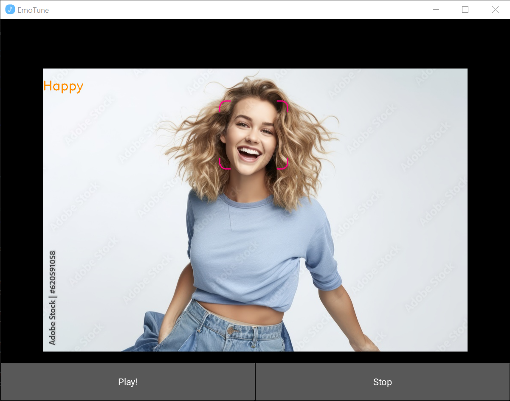
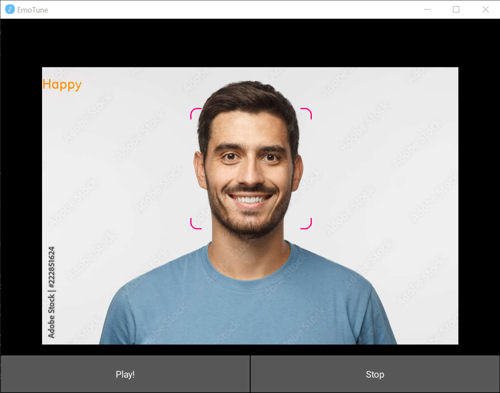
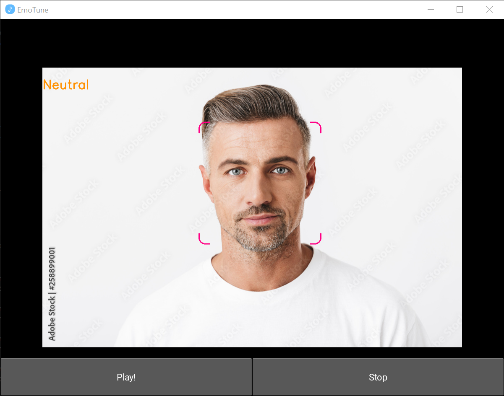

# Emotune
Emotune is a *realtime facial expression based music player* which captures the facial expression in real-time and plays music accordingly. (This project was part of CSI Paper Presentation)

## Samples



<!--- OLD REPO
<video src="https://codeberg.org/Dragonblaze242/emotune/raw/branch/main/readme_data/emotune_sample.mp4" controls="controls"  style="max-width: 601px;"></video>
-->


https://github.com/user-attachments/assets/21715635-74a8-46ce-a236-a8729ce0b7fa


## Features
-	This is complete GUI based application.
-	Created using Python and Deepface, Kivy, OpenCV libraries.
-	The webcam is accessed by OpenCV and face is captured through Haar Cascade Classifier.
-	Then facial expressions are compared with predefined models to get the emotion. Here lightweight library Deepface is used.
-	This GUI base is created by Kivy. After getting the emotion the correct music is played by Kivy.

## Dependencies
- OpenCV
- Kivy
- TensorFlow
- Deepface

```
pip install -r requirements.txt
```
